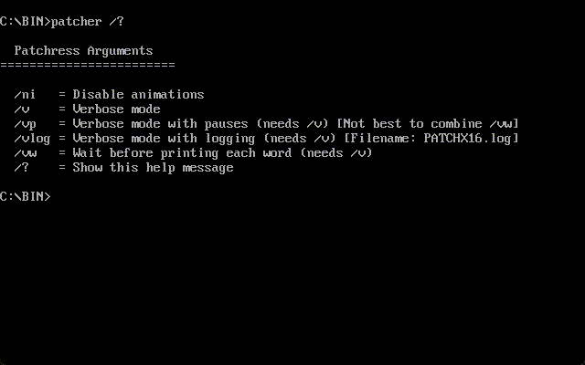

# MultiPatcher

The MultiPatcher is a utility/collection of utilities & patches for Operating Systems ranging from MS-DOS to Microsoft Windows 11.

## Features

MultiPatcher can bundle utilities, patches, visual system modifications, or drivers as-is, or can produce a wrapper around it which expands upon it (ex, a wrapper that lets you modify System environmental paths when the patch itself won't let you).

MultiPatcher:

- is lightweight
- can run under MS-DOS, Win3.1 & NT, till the latest and crappiest Win11
- is your one-stop shop to make your computer pretty (or fix it)
- provides an easy to use interface
- tries making system modifications more robust
- doesn't track you

## Screenshots

## Architecture

- MS-DOS uses a 16-bit terminal application made using the TurboC 3 compiler.
- Windows 3.1, 95-Me and NT 3.1 - XP share a 16-bit VisualBasic 4.0 application.
- Windows Vista and above use an application made using Delphi.

In order to provide a seamless experience, 'Patcher.bat' was added. This batch file tries to automatically figure out whether you are running MS-DOS or Windows. If it detects that you are running MS-DOS, it launches 'patchx16.exe'. If it detects that you are running Windows 3.1, 95-Me, or NT3.1-XP, it launches 'patchg16.exe'. If it detects that you are running Windows Vista and above, it launches 'patchg32.exe'.

The 'RES/' folder contains required files for MultiPatcher to function properly. Inside 'RES/DATA', it contains the files required by any of the MultiPatcher user interfaces. The patches, utilities, etc. are located inside 'RES/' with specific corresponding directories.

- If the directory contains the file 'lfn.ini', MultiPatcher treats it as a menu. To view more, refer [Structure of LFN.INI](docs/ini_structures.md#structure-of-lfnini)
- If the directory contains the file 'info.ini', MultiPatcher treats it as an entry. To view more, refer [Structure of INFO.INI](docs/ini_structures.md#structure-of-infoini)

## Goals

The goal here is to make an independent and lightweight utility where the users can use it to launch other utilities or patches. We don't want heavy applications like some Partition manager, but something like the Windows Update Blocker is welcomed.

## Compiling

For compiling, see [Building](docs/building.md)

## Credits

For a list of Utilities included, please view [CREDITS](CREDITS.md). Thank you.
