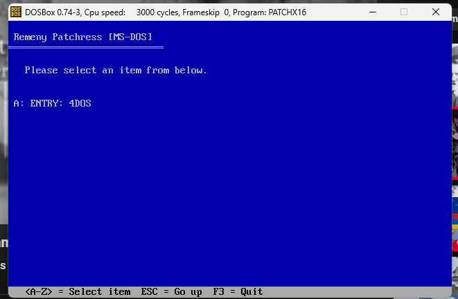

# System Patchress by Remeny

The Patchress is a utility/collection of utilities & patches for Operating Systems ranging from MS-DOS to Microsoft Windows 11. This project can be thought as a continuation of the earlier MultiPatcher project, although no actual code is taken from it.

## Screenshots

## Architecture
The menus (contents to be displayed per window) should be written in a made-up pseudo language (view MENUS.md). This way, no matter if you start Patchress from MS-DOS or Windows XP, the application can correctly display stuff.

When the user executes an interface for Patchress, it assumes the path './RES' to exist. From there, it loads './RES/INIT.PIN', where 'INIT.PIN' is written in the Patchress language. Subsequent Windows (pages) can be loaded & window controls can be added using any *.PIN file.

## Goals
The goal here is to make an independent and lightweight utility where the users can use it to launch other utilities. We don't want heavy applications like some Partition manager, but something like the Windows Update Blocker is welcomed.

## Credits
For a list of Utilities included, please view CREDITS.TXT. Thank you.

# X-----X